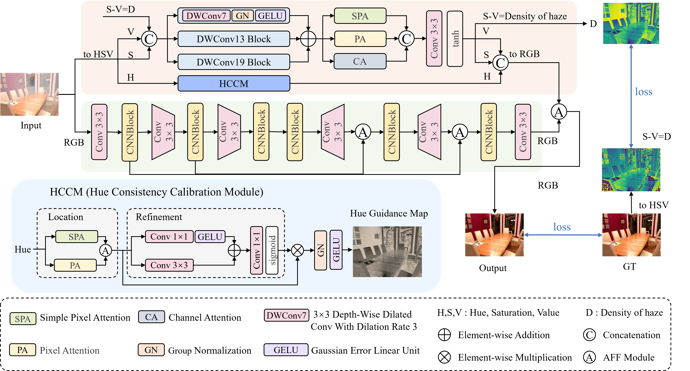
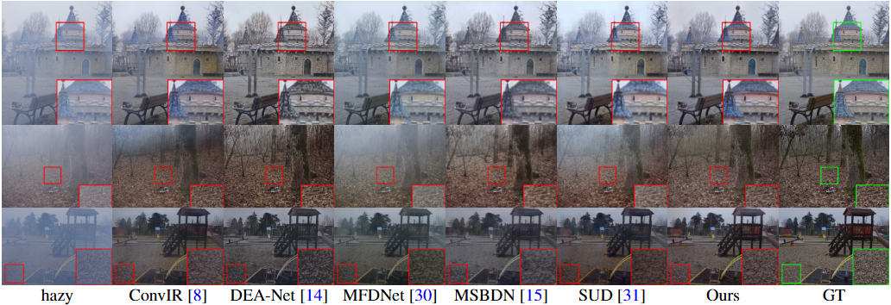
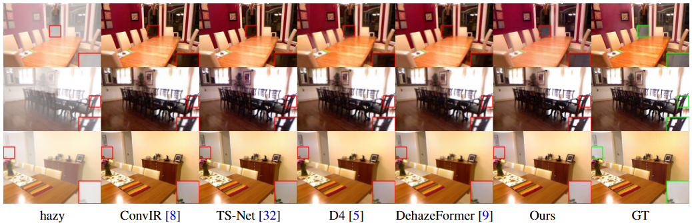

# HSV-DehazeNet: Hue Consistency Calibration and Haze Density Supervision for Image Dehazing

[](LICENSE)
[](https://pytorch.org/)

> **Authors:** Yi Ren, Hongyuan Jing, Songhao Wu, Wenlu Yang, Mengfei Han, Jinjin Hu, Kehong Li*, Mengmeng Zhang  
> **Affiliation:** Beijing Union University  
> **Contact:** [renyi@buu.edu.cn](mailto:renyi@buu.edu.cn), [jqrkehong@buu.edu.cn](mailto:jqrkehong@buu.edu.cn)

---

## 📢 Introduction

This repository contains the official implementation of the paper **"HSV-DehazeNet: Hue Consistency Calibration and Haze Density Supervision for Image Dehazing"**.

**Abstract:**
Single image dehazing is a key low-level vision task for enhancing visibility. However, RGB-based methods often suffer from color distortion and residual haze due to strong inter-channel coupling. From the HSV perspective, we observe that the hue-channel distribution remains relatively stable before and after dehazing. Based on this insight, we propose **HSV-DehazeNet**, a novel dehazing framework that effectively integrates HSV color space priors into a deep learning architecture. Our approach features:

1.  **Hue Consistency Calibration Module (HCCM):** A module designed to correct subtle hue shifts and preserve color fidelity by leveraging pixel-wise attention.
2.  **Haze Density Supervision (HDS):** A mechanism that imposes explicit supervision on the haze distribution. It is grounded in the physical prior that haze density is proportional to the absolute difference between saturation and value ($D \propto |S - V|$).

Experiments demonstrate that our method achieves state-of-the-art performance on real-world datasets (O-HAZE, I-HAZE) and exhibits superior generalization on unpaired benchmarks.

---

## 🖼️ Network Architecture

Our framework is built upon a standard encoder-decoder backbone, enhanced by HSV-domain guidance to ensure both structural restoration and color accuracy.

<p align="center">
  
</p>


### Key Components:
- **Hue Consistency Calibration Module (HCCM):** Specifically targets the Hue component to mitigate color distortions often introduced by standard CNNs.
- **Haze Density Supervision (HDS):** Instead of relying solely on reconstruction loss, HDS leverages the saturation-value discrepancy ($|S - V|$) to guide the network in recognizing and removing uneven haze distributions.

---

## 📊 Quantitative Results

We compare HSV-DehazeNet with state-of-the-art methods on multiple challenging benchmarks.

### 1. Real-world Paired Datasets (O-HAZE & I-HAZE)
Our method achieves the **best performance** on both O-HAZE and I-HAZE datasets, striking an optimal balance between accuracy and computational efficiency.

| Method | Venue | O-HAZE (PSNR / SSIM) | I-HAZE (PSNR / SSIM) | FLOPs (G) | Params (M) |
| :--- | :---: | :---: | :---: | :---: | :---: |
| MSBDN | CVPR'20 | 18.24 / 0.5371 | 15.14 / 0.5371 | 166.0 | 31.3 |
| D4 | CVPR'22 | 17.80 / 0.6611 | 15.81 / 0.7503 | 8.9 | 9.5 |
| MFDNet | TIP'23 | 19.37 / 0.7457 | 16.41 / 0.7549 | 250.3 | 4.7 |
| RSHazeNet| ICASSP'24| 21.14 / 0.7067 | 17.20 / 0.7081 | 40.1 | 1.2 |
| ConvIR | TPAMI'24| 20.62 / 0.7800 | 15.56 / 0.7309 | 129.3 | 14.8 |
| SUD | TIM'25 | 20.70 / 0.6827 | 15.66 / 0.5990 | 93.9 | 2.5 |
| **Ours** | **-** | **22.96 / 0.8171** | **18.23 / 0.7723** | **165.1** | **6.3** |

### 2. Challenging Non-Uniform & Dense Haze

| Method | NH-HAZE (PSNR / SSIM) | Dense-Haze (PSNR / SSIM) |
| :--- | :---: | :---: |
| MSBDN | 15.70 / 0.3166 | 13.73 / 0.4426 |
| D4 | 11.81 / 0.4258 | 8.96 / 0.4581 |
| ConvIR | **17.75** / **0.6159** | 15.62 / 0.5781 |
| SUD | 16.25 / 0.5726 | **16.43** / 0.5385 |
| **Ours** | 17.34 / 0.6041 | 15.80 / **0.5805** |

### 3. Synthetic Datasets

| Method | Haze4K (PSNR / SSIM) | RESIDE-6K (PSNR / SSIM) |
| :--- | :---: | :---: |
| MFDNet | 27.54 / **0.9697** | **28.34** / **0.9601** |
| SUD | **29.27** / 0.8907 | 29.16 / 0.8816 |
| **Ours** | 27.70 / 0.9632 | 26.54 / 0.9215 |

---

## 👁️ Visual Comparison

### O-HAZE Dataset (Outdoor)
Our method effectively removes dense haze while preserving the natural color of the background (e.g., the red building), whereas other methods suffer from color shifts or residual haze.



### SOTS Dataset (Indoor)
In indoor scenes, HSV-DehazeNet recovers texture details and correct white balance better than competing methods.



---

## 🛠️ Installation & Usage

### 1. Dependencies
The code is developed and tested on **Python 3.8+** and **PyTorch**.

```bash
# Install dependencies
python -m pip install torch torchvision kornia numpy pillow opencv-python matplotlib tqdm

```

### 2. Dataset Preparation

Please organize your dataset as follows:

```
datasets_root/
  └─ O-HAZE/
      ├─ train/
      │   ├─ hazy/  (source images)
      │   └─ GT/    (ground truth)
      └─ test/
          ├─ hazy/
          └─ GT/

```

### 3. Training

To train the model from scratch:

```bash
python main.py --path "/path/to/datasets_root" --dataset_name "O-HAZE" --bs 2 --steps 30000 --crop --crop_size 256

```

**Key Arguments:**

* `--model_name`: Name of the experiment (for logging).
* `--dataset_name`: Folder name of the dataset.
* `--steps`: Total training steps.
* `--resume`: Add this flag to resume from the latest checkpoint.

### 4. Testing / Inference

To test the model and calculate PSNR/SSIM:

```bash
python main.py --path "/path/to/datasets_root" --dataset_name "O-HAZE" --eval_step 100 --resume

```

---

## 📝 Citation

If you find this project useful for your research, please consider citing our paper:

```bibtex
------------------------
```

